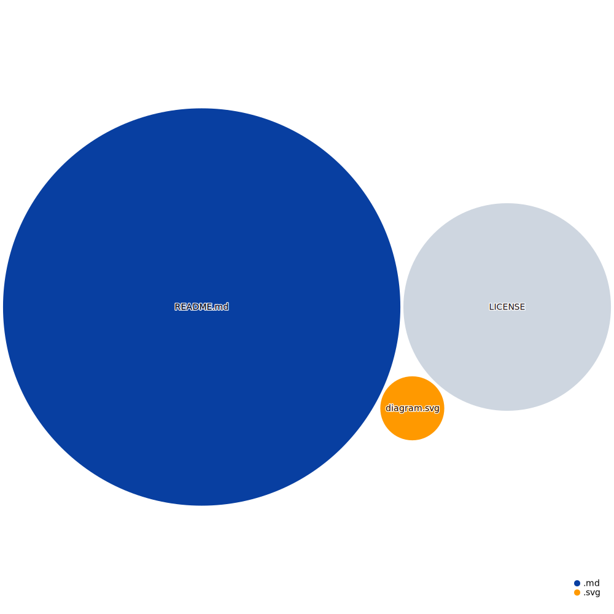

# ChickenVision Mobile App

Welcome to the ChickenVision mobile app repository! This repository contains the source code for the mobile app developed for Android phones. The goal of this project is to use augmented reality to replace faces in a crowd with a chicken helmet.

## Overview

The ChickenVision mobile app is built using Kotlin, a modern and efficient programming language for Android app development. The app also uses Python for video processing, AWS for cloud computing and server hosting, and Amplify for backend development.

The app allows users to point their phone's camera at a crowd and replace all the faces with a chicken helmet using augmented reality technology. The app also includes features such as image recognition software and a server or cloud service to process the images.

## Planned UI/UX

## Details on UI/UX Design

### Record Button Placement

Considering the size of modern mobile phones, placing the record button at the bottom can make it difficult for users to reach. A higher placement on the right edge of the screen provides better grip and accessibility for users with smaller hands, reducing the need to use both hands.

If you think about it, it is natural for human hands to be on the right edge of the phone, because the grip is better. Why move drag it so far down?

> 

Why those specific positions for the buttons and the menu?

> 

> 
> 
> 

> 
 

## Button and Menu Positioning

The buttons and menu are positioned to maximize screen real estate and minimize interference with the primary video view. This design choice allows users to focus on capturing the scene with a comfortable grip.

> 

What if the record button was a bit higher?

> 

> Then alot of valuable space on the screen is taken up. 
> 
> 

> 
 

### What about filming diagonally?

The app's UI is designed to accommodate diagonal filming, enabling users to capture footage at various angles while maintaining easy access to the record button and other functionalities.

> 

Why those specific positions for the buttons and the menu?

> 

> 
> 

> 
 

### Later UI feature 

We plan to introduce a lock feature, enabling users to record without holding the record button, further enhancing user experience.

## Codebase Visualization

## License

The ChickenVision mobile app project is licensed under the MIT License. See the `LICENSE` file for details.

<!-- ## Acknowledgements

We would like to thank GitHub and DEV for hosting the GitHub + DEV 2023 Hackathon, which provided the inspiration and motivation for this project. We would also like to thank our the Pavoculus team members and contributors for their hard work and dedication in developing the ChickenVision mobile app. -->
