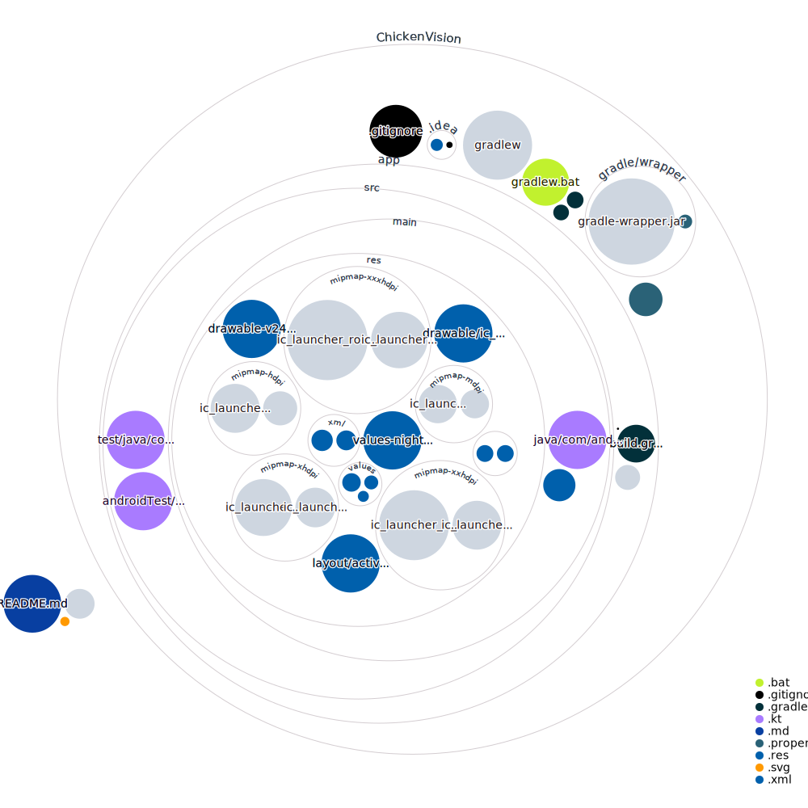

# ChickenVision Mobile App

Welcome to the ChickenVision mobile app repository! This repository contains the source code for the mobile app developed for Android phones. The goal of this project is to use augmented reality to replace faces in a crowd with a chicken helmet.

## Overview

The ChickenVision mobile app is built using Kotlin, a modern and efficient programming language for Android app development. The app also uses Python for video processing, AWS for cloud computing and server hosting, and Amplify for backend development.

The app allows users to point their phone's camera at a crowd and replace all the faces with a chicken helmet using augmented reality technology. The app also includes features such as image recognition software and a server or cloud service to process the images.

## Codebase Visualization

## License

The ChickenVision mobile app project is licensed under the MIT License. See the `LICENSE` file for details.

<!-- ## Acknowledgements

We would like to thank GitHub and DEV for hosting the GitHub + DEV 2023 Hackathon, which provided the inspiration and motivation for this project. We would also like to thank our the Pavoculus team members and contributors for their hard work and dedication in developing the ChickenVision mobile app. -->
